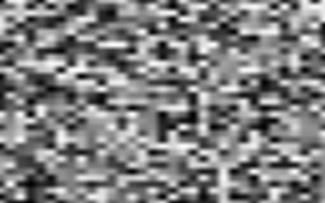
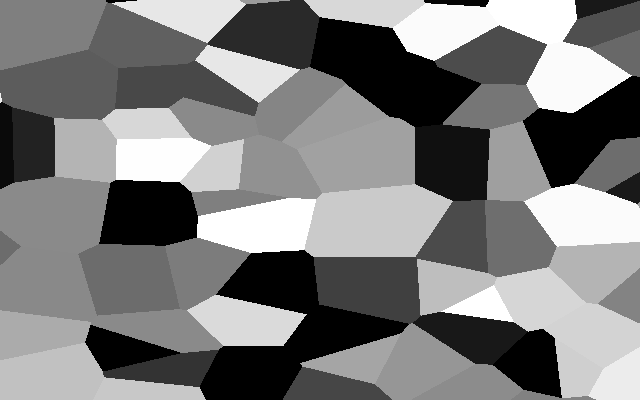
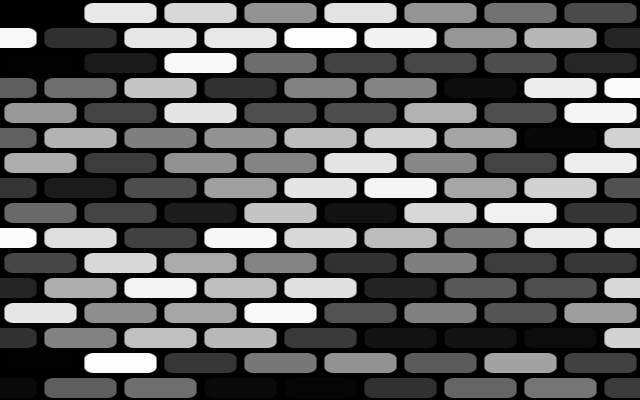

A curated list of common 2D noises and patterns in computer graphics. Mostly taken from implementations on [Shadertoy](www.shadertoy.com). All implementations are under the MIT or similar.

This library is intended for users who need access to raw, unprocessed noise values in Rust. This is not intended to be an effect or post processing library. All returned values are between [0..1].

Noise classes support both raw noises as well as smooth FBM variants.

This library uses the [nalgebra-glm](https://docs.rs/nalgebra-glm/latest/nalgebra_glm/) crate as the math library (and is also its only dependency). The API however has no external dependencies.

### Precision

By default the library compiles to ```f32``` via a type definition of ```FP``` in *lib.rs*, you can change the type as instructed and compile the library to ```f64``` if needed.

### The Traits

The traits for noises and patterns are very simple.

```rust
pub trait Noise {

    fn new() -> Self;

    /// 2D noise for the given position
    fn noise_2d(&self, p: (FP, FP)) -> FP;

    // 2D fbm for the given position and the octaves
    fn fbm_2d(&self, p: (FP, FP), octaves: i32) -> FP;
}

pub trait Pattern {

    fn new() -> Self;

    /// 2D noise for the given position
    fn pattern_2d(&self, p: (FP, FP)) -> FP;

    /// For setting pattern properties
    fn set_property(&mut self, name: &str, value: FP);
}

```

# Noises

## Value Noise

Based on [1D, 2D & 3D Value Noise](https://www.shadertoy.com/view/4dS3Wd)

```rust
let mut pixels = vec![0;width * height * 4];
let noise = Value::new();

for y in 0..height {
    for x in 0..width {
        let scale = 8.0;
        // let v = noise.get_2d((((x as FP) / width as FP) * scale, ((y as FP) / height as FP) * scale));
        let v = noise.fbm_2d((((x as FP) / width as FP) * scale, ((y as FP) / height as FP) * scale), 5);

        let v_u8 = (v * 255.0) as u8;
        let color = [v_u8, v_u8, v_u8, 255];

        let d = x * 4 + y * width * 4;

        pixels[d..d+4].copy_from_slice(&color);
    }
}
```

<table><tr>
<td>  </td>
<td>  </td>
</tr></table>

## VoronoiBasic

Based on [Voronoi Basic](https://www.shadertoy.com/view/MslGD8)

```rust
let mut pixels = vec![0;width * height * 4];
let noise = VoronoiBasic::new();

for y in 0..height {
    for x in 0..width {
        let scale = 8.0;
        let v = noise.get_2d((((x as FP) / width as FP) * scale, ((y as FP) / height as FP) * scale));

        let v_u8 = (v * 255.0) as u8;
        let color = [v_u8, v_u8, v_u8, 255];

        let d = x * 4 + y * width * 4;

        pixels[d..d+4].copy_from_slice(&color);
    }
}
```



# Patterns

## Bricks

Based on [Bricks and Tiles](https://www.shadertoy.com/view/lsVyRK). Used here with permission from Fabrice under the MIT.

```rust
let mut pixels = vec![0;width * height * 4];
let mut bricks = Bricks::new();
bricks.set_property("round", 0.0);

for y in 0..height {
    for x in 0..width {
        let v = bricks.pattern_2d(((x as FP / width as FP), (y as FP / height as FP)));

        let v_u8 = (v * 255.0) as u8;
        let color = [v_u8, v_u8, v_u8, 255];

        let d = x * 4 + y * width * 4;

        pixels[d..d+4].copy_from_slice(&color);
    }
}
```



Supported properties:

```rust
// The ratio of width / height of the bricks. 1.0 means they are square, larger values increases the width, default 2.0.
bricks.set_property("ratio", 1.0);
// A value of 1.0 (default) offsets every second line, otherwise aligns the bricks vertically.
bricks.set_property("brick", 0.0);
// The cell size, a global scaling factor, default 16.0
bricks.set_property("cell", 16.0);
// The gap between bricks, default 0.08.
bricks.set_property("gap", 0.1);
// The bevel of the brick, larger values provide a smoother transition, by default 0.07.
bricks.set_property("bevel", 0.1);
// The roundness of the brick, 0.0 creates square bricks, 1.0 circular ones. Default is 0.25.
bricks.set_property("round", 0.25);
```
